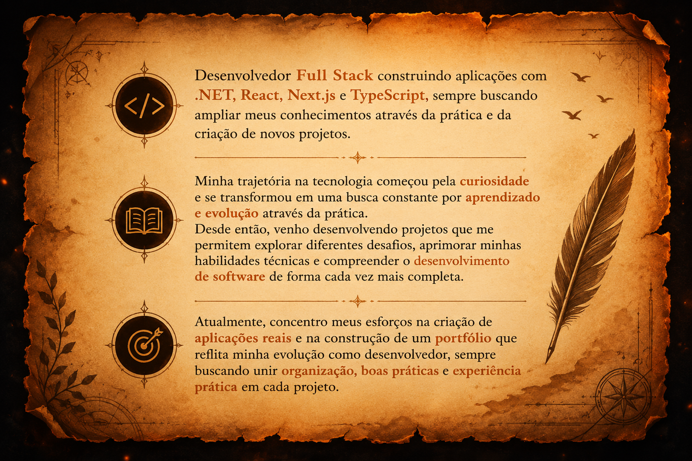

  

---

# Sobre Mim

<table>
<tr>

<td width="220">

</td>

<td>

</td>

</tr>
</table>

---

#  Back-end

<table align="center">

<tr>
<td width="60">

</td>
<td>C#</td>
</tr>

<tr>
<td width="60">

</td>
<td>.NET</td>
</tr>

<tr>
<td width="60">

</td>
<td>SQL Server</td>
</tr>

</table>

---

# Front-end

<table align="center">

<tr>
<td width="60">

</td>
<td>React</td>
</tr>

<tr>
<td width="60">

</td>
<td>Next.js</td>
</tr>

<tr>
<td width="60">

</td>
<td>TypeScript</td>
</tr>

<tr>
<td width="60">

</td>
<td>Tailwind CSS</td>
</tr>

</table>

---

# Ferramentas

<table align="center">

<tr>
<td width="60">

</td>
<td>Git</td>
</tr>

<tr>
<td width="60">

</td>
<td>Docker</td>
</tr>

</table>

---

# Estatísticas

